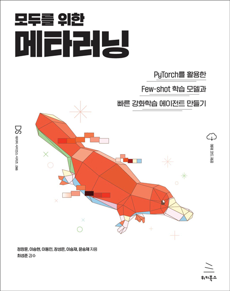

# 모두를 위한 메타러닝
### PyTorch를 활용한 Few-shot 학습 모델과 빠른 강화학습 에이전트 만들기

- 정창훈, 이승현, 이동민, 장성은, 이승재, 윤승제 지음 | 최성준 감수
- 26,000원 | 2022년 10월 25일 발행 | 284쪽
- [책 홈페이지](https://wikibook.co.kr/metalearning/)
- [도서 미리보기](http://www.yes24.com/Product/Viewer/Preview/114669079)
- [도서 관련 문의](https://wikibook.co.kr/support/contact/)

---

**지도학습과 강화학습을 위한 최신 기술 메타러닝을 이해하자!**

이 책은 최근 인공지능과 머신러닝 분야에서 각광받고 있는 메타러닝에 대한 입문 서적입니다. 독자 여러분께서 다소 생소할 수 있는 메타러닝에 대한 개념을 이해하고 실제로 세부 알고리즘들까지 구현해보는 기회를 제공하는 것을 목표로 합니다. 특히 메타러닝에서 회귀 문제, 분류 문제를 다루는 메타 지도학습뿐 아니라, 강화학습을 소개하고 이에 대해 메타러닝을 적용한 메타 강화학습까지 심도 있게 다루는 것이 이 책의 큰 장점입니다. 처음에는 다소 생소할 수 있지만, 꾸준히 이 책을 반복해서 읽고 실습하면 멋진 최신 머신러닝 기술인 메타러닝을 한층 깊이 이해할 수 있을 것입니다.

---
 
 ## 구입처
 
 - [예스24](http://www.yes24.com/Product/Goods/114669079)
 - [교보문고](https://product.kyobobook.co.kr/detail/S000200033282)
 - [인터파크](https://book.interpark.com/product/BookDisplay.do?_method=detail&sc.prdNo=355752271)
 - [알라딘](https://www.aladin.co.kr/shop/wproduct.aspx?ItemId=303086795)

---

## 예제 코드 안내

본 도서의 예제 코드는 저자가 직접 관리하는 아래 깃허브 저장소를 통해 확인하실 수 있습니다.

- <https://github.com/dongminlee94/meta-learning-for-everyone/>
